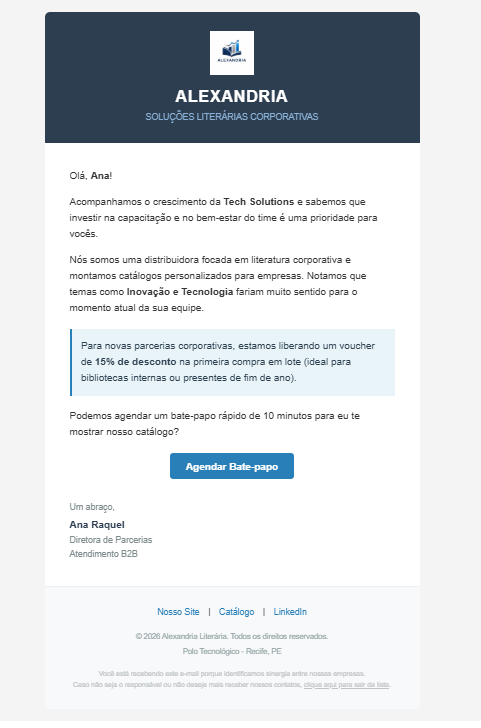

# 🚀 Automação B2B: Sistema de Disparo de E-mails Corporativos

Este projeto é uma solução automatizada para o envio de e-mails comerciais (Cold Mail / B2B) personalizados. Ele integra processamento de dados em nuvem com disparo de e-mails em massa, focando na separação entre **Lógica de Negócio** (Google Sheets) e **Lógica de Código** (Python + GitHub Actions).

## 🎯 O Problema Resolvido
Equipes de vendas geralmente perdem horas enviando e-mails comerciais manualmente. Além disso, colocar scripts locais nas mãos de times de negócios (que não têm Python instalado) gera atritos. 

**A Solução:** Criei uma arquitetura onde a equipe de Vendas apenas atualiza uma planilha no Google Sheets (como já estão acostumados). Quando a campanha está pronta, qualquer usuário pode acionar um gatilho na nuvem (GitHub Actions) que puxa os dados ao vivo da planilha e dispara e-mails HTML personalizados e responsivos para cada cliente.



## 🛠️ Tecnologias Utilizadas
* **Python 3.13:** Motor principal da aplicação.
* **Pandas:** Para extração, leitura e manipulação dos dados via URL.
* **SMTP (smtplib / email.message):** Para conexão segura com servidores de e-mail.
* **HTML/CSS:** Para a criação de templates de e-mail profissionais e responsivos.
* **Google Sheets:** Como Banco de Dados em nuvem (via publicação CSV).
* **GitHub Actions:** Para CI/CD e execução do script na nuvem via `workflow_dispatch`.

## ⚙️ Arquitetura do Sistema
1. **Input de Dados:** O usuário atualiza a base de leads no Google Sheets.
2. **Gatilho (Trigger):** Acionamento manual seguro através da aba *Actions* no GitHub.
3. **Processamento:** O ambiente virtual (Ubuntu) inicializa, instala as dependências, injeta as variáveis de ambiente (Secrets) e puxa o `.csv` direto da nuvem.
4. **Output:** Envio sequencial dos e-mails formatados.

## 🚀 Como rodar o projeto localmente

### Pré-requisitos
* Python 3 instalado.
* Uma conta de e-mail (Gmail) com "Senha de App" configurada.

### Passo a Passo
Instale as dependências:

pip install -r requirements.txt
Crie um arquivo .env na raiz do projeto com as suas credenciais:

Snippet de código
MEU_EMAIL=seu_email@gmail.com
SENHA_APP=sua_senha_de_app
Execute o script:


python main.py

🔒 Segurança e Boas Práticas
Gestão de Segredos: Nenhuma credencial é exposta no código. Localmente usamos a biblioteca python-dotenv e, na nuvem, o GitHub Secrets.

Em campanhas B2B reais, envios agendados via Cron podem ser perigosos (empresas fecham, pessoas trocam de cargo). Por isso, optei propositalmente pela arquitetura de Gatilho Manual, garantindo que um humano revise a base de dados no Sheets antes do disparo.

Desenvolvido por [Ana Raquel] 


1. Clone o repositório:
   ```bash
   git clone [https://github.com/anaraque-l/projeto_emails_b2b.git](https://github.com/anaraque-l/projeto_emails_b2b.git)
